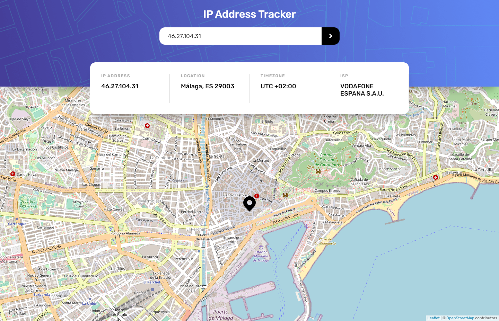
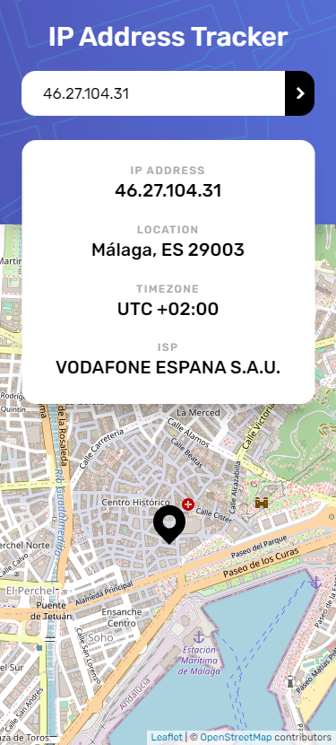

#IP Adress Tracker 

This is a solution to the [IP address tracker challenge on Frontend Mentor](https://www.frontendmentor.io/challenges/ip-address-tracker-I8-0yYAH0). Frontend Mentor challenges help you improve your coding skills by building realistic projects.

## Table of contents

- [Overview](#overview)
  - [The challenge](#the-challenge)
  - [Screenshot](#screenshot)
  - [Links](#links)
- [My process](#my-process)
  - [Built with](#built-with)
- [Author](#author)

## Overview

### The challenge

Users should be able to:

- View the optimal layout for each page depending on their device's screen size
- See hover states for all interactive elements on the page
- See their own IP address on the map on the initial page load
- Search for any IP addresses or domains and see the key information and location

### Screenshot

### Links

- Solution URL: [Github URL](https://github.com/atorres-io/frontend-mentor-ip-address-tracker)
- Live Site URL: [Live URL](https://hopeful-blackwell-1aa8c9.netlify.app/)

## My process

### Built with

- Prettier
- JavaScript
- Clean Code
- API
- Flexbox
- CSS Grid
- Responsive
- [React](https://reactjs.org/) - JS library

### What I learned

Using IpAdress API and react-leaflet.

## Author

- Instagram - [@developer_rahul_](https://www.instagram.com/developer_rahul_)
- Github - [@developerrahulofficial](https://github.com/developerrahulofficial)
- Youtube - https://www.youtube.com/channel/UCzB2vC0kH-PPbrGmqeII9hQ
